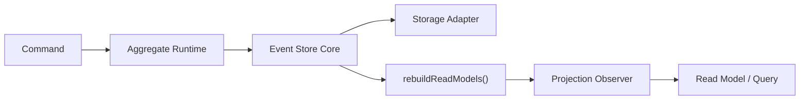

# Architecture

This repository now has one primary architecture:

- `@schemeless/event-store-core`
- `@schemeless/event-store-aggregate`
- adapter capability contracts in `@schemeless/event-store-types`

The legacy `@schemeless/event-store` package remains in the tree for historical compatibility, but new work should target the V6 packages.

## Layers

### Core

`event-store-core` is the persisted event log and read-model rebuild engine.

It owns:

- append
- stream reads
- paginated scans
- `rebuildReadModels()`
- projection observers
- import/export

It does not own:

- aggregate hydration
- command decisions
- aggregate state transitions
- replay-as-recovery semantics

### Aggregate runtime

`event-store-aggregate` owns command handling and aggregate hydration.

It owns:

- `hydrate()`
- `handle()`
- `precondition`
- `decide`
- `validateEvent`
- `evolve`
- `appendToStream(expectedVersion)`

It does not own:

- read-model rebuild
- observer execution
- projection recovery

## Event flow

## Key rules

- Replay is for read-model rebuild, not aggregate recovery.
- Aggregate writes depend on stream version, not projection freshness.
- Observers receive persisted events only.
- `event.identifier` is the canonical stream key.
- `evolve(state, event)` is the only aggregate state transition.

## Capabilities

Adapters now advertise capability support explicitly:

- core event log
- stream query
- optimistic concurrency
- snapshot

Use these flags to decide whether an adapter can support a particular runtime.
