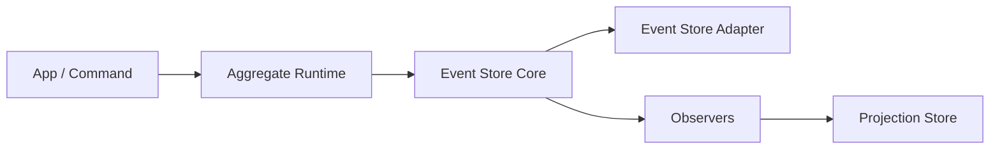

# Architecture

V6 splits the repository into four layers:

## Layers

- `@schemeless/event-store-core`

  - append events
  - scan the log
  - read streams
  - rebuild read models

- `@schemeless/event-store-aggregate`

  - hydrate aggregate state
  - run `precondition`
  - `decide` domain events
  - `evolve` state
  - append with optimistic concurrency

- `@schemeless/event-store-types`

  - `PersistedEvent`
  - `Snapshot`
  - `EventStoreAdapter`
  - `StreamEventStoreAdapter`

- adapters
  - implement storage concerns
  - do not define business logic

## Design Rules

- event stream is the source of truth
- log scans/export/rebuild run in storage commit order, not `event.created` order
- snapshots are persisted acceleration only
- memory cache is disposable acceleration only
- `identifier` is the canonical aggregate key and must be non-empty for stream operations
- `evolve` is the only state transition function
- read-model rebuild is separate from aggregate hydrate
