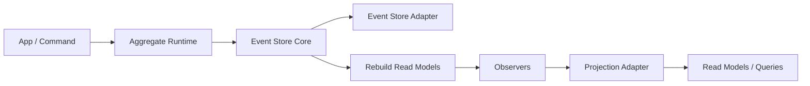

# RFC: Split Event Store Into Core + Aggregate Runtime

## Status

Draft

## Summary

Redesign the current event-store library into two explicit layers:

- `@schemeless/event-store-core`
- `@schemeless/event-store-aggregate`

The core package becomes a storage and replay engine. The aggregate package becomes a command-handling runtime built on top of stream loading and optimistic concurrency.

This RFC intentionally does **not** preserve the current `EventFlow` / `AggregateEventFlow` model. The goal is a cleaner architecture that is easier for both humans and AI coding tools to understand, modify, and debug over time.

## Why

The current design mixes two different responsibilities into one runtime:

- event log / replay / projection rebuild
- aggregate hydration / command validation / stateful decision making

That creates several long-term problems:

- `validate` carries more than one meaning
- `replay()` is easy to misread as startup recovery, even though it also drives observers
- aggregate identity is split between runtime `getIdentifier()` logic and persisted `event.identifier`
- live submit and replay share hooks but do not mean the same thing

This ambiguity is survivable for short-term manual maintenance, but it is a poor fit for long-term AI-assisted iteration. AI tools work best when:

- public hooks have one meaning
- each API belongs to one lifecycle phase
- critical invariants have one source of truth
- correctness boundaries are explicit

## Goals

- Separate event-log concerns from aggregate command-runtime concerns
- Make replay a read-model rebuild tool, not a hidden aggregate recovery tool
- Make aggregate identity canonical and persisted
- Make aggregate state transition use exactly one function
- Make adapter capabilities explicit
- Prefer architecture that remains understandable after many AI-generated edits

## Non-Goals

- Preserve backward compatibility with `EventFlow` or `AggregateEventFlow`
- Keep `submit(flow, input)` as the main write-side API
- Support replay as a substitute for aggregate startup recovery
- Allow read-model freshness to be required for write correctness

## Design Principles

### 1. One Meaning Per Hook

No hook should carry both command-time and replay-time semantics.

### 2. One Meaning Per API

Each public API should belong to one phase only.

### 3. One Source of Truth Per Core Concept

- aggregate identity: `event.identifier`
- aggregate state transition: `evolve(state, event)`
- system truth: persisted event stream

### 4. Event Stream Is Truth

- event stream = truth
- snapshot = persisted acceleration
- in-memory cache = disposable acceleration

### 5. Replay Means Read-Model Rebuild

Replay is for rebuilding observers and projections. It is not the write-side recovery mechanism for aggregates.

## Proposed Package Structure

- `@schemeless/event-store-types`
- `@schemeless/event-store-core`
- `@schemeless/event-store-aggregate`
- `@schemeless/event-store-adapter-*`

## Architecture Overview



The aggregate runtime decides whether new events can be produced. The core package stores and scans events. Observers update disposable read models after events are committed.

## Core Layer

### Responsibilities

`event-store-core` is responsible for:

- appending events
- reading stream events
- scanning all events
- rebuilding read models
- import/export utilities
- optional snapshot storage hooks

It is not responsible for:

- command handling
- aggregate validation
- aggregate hydration as a domain API
- stateful decision logic

### Core API

```ts
export interface EventStoreCore {
  append(events: PersistedEvent[]): Promise<void>;

  stream(domain: string, identifier: string, options?: { fromSequence?: number }): Promise<PersistedEvent[]>;

  scan(options?: { pageSize?: number; startFromId?: string }): Promise<AsyncIterable<PersistedEvent[]>>;

  rebuildReadModels(options?: {
    startFromId?: string;
    observers?: Observer[];
    reset?: () => Promise<void>;
  }): Promise<void>;

  export(options?: { pageSize?: number }): Promise<PersistedEvent[]>;

  import(
    events: PersistedEvent[],
    options?: {
      replace?: boolean;
    }
  ): Promise<void>;
}
```

### Observer Model

Observers in core are projection-only:

```ts
export interface Observer {
  name: string;
  filters: Array<{ domain: string; type: string }>;
  priority?: number;
  fireAndForget?: boolean;

  apply(event: PersistedEvent): Promise<void> | void;
}
```

Observers do not receive aggregate state. Aggregate state belongs to the aggregate runtime, not the replay engine.

## Aggregate Layer

### Responsibilities

`event-store-aggregate` is responsible for:

- hydrating aggregate state from stream history
- running command preconditions
- deciding domain events
- evolving aggregate state
- appending events with optimistic concurrency

It is not responsible for:

- rebuilding read models
- replaying observers
- generic event-log concerns

### Aggregate API

```ts
export interface AggregateRuntime {
  handle<C, E extends DomainEvent, S>(aggregate: AggregateDefinition<C, E, S>, command: C): Promise<HandleResult<E, S>>;

  hydrate<E extends DomainEvent, S>(
    aggregate: AggregateDefinition<any, E, S>,
    identifier: string
  ): Promise<HydratedAggregate<S>>;
}
```

```ts
export interface AggregateDefinition<Command, Event extends DomainEvent, State> {
  name: string;
  domain: string;

  getIdentifier(input: Command | Event): string;

  initialState: State;

  evolve(state: State, event: Event): State;

  precondition?(command: Command, state: State, ctx: AggregateContext): Promise<void> | void;

  decide(command: Command, state: State, ctx: AggregateContext): Promise<Event[]> | Event[];

  validateEvent?(event: Event, state: State, ctx: PhaseContext): Promise<void> | void;
}
```

```ts
export interface HydratedAggregate<State> {
  identifier: string;
  state: State;
  version: number;
}

export interface HandleResult<Event, State> {
  identifier: string;
  events: Event[];
  nextState: State;
  version: number;
}
```

### Aggregate Lifecycle

`handle(command)` runs like this:

1. Resolve aggregate identifier from `aggregate.getIdentifier(command)`
2. Load snapshot if available
3. Load stream events after snapshot sequence
4. Fold current state with `evolve`
5. Run `precondition(command, state)`
6. Run `decide(command, state)` to produce `Event[]`
7. Canonicalize the identifier onto every produced event
8. Optionally run `validateEvent(event, state)`
9. Append using optimistic concurrency
10. Fold the new events with `evolve`
11. Optionally save snapshot
12. Return `HandleResult`

## Canonical Aggregate Identity

This redesign makes aggregate identity a hard invariant.

- `aggregate.getIdentifier(...)` defines how identity is computed
- the runtime must write that value into persisted `event.identifier`
- stream queries, snapshot keys, and optimistic concurrency all use this same field

The system must not allow a state where:

- runtime code can compute the aggregate identifier
- but persisted events do not store that identifier canonically

## Single State Transition Function

Aggregate state transition uses exactly one function:

```ts
evolve(state, event) => state
```

There is no second aggregate-level `apply()` that also changes state.

This keeps:

- live handling
- aggregate hydration
- aggregate rebuild from snapshots

on the same logic path.

## Validation Model

Validation is split into two separate responsibilities.

### `precondition`

- runs only during `handle(command)`
- answers: "can the system accept this new intent right now?"
- may read projections or external services
- is not replay-safe by default

**Consistency boundary:** projections and external services read inside `precondition` are
potentially stale. They may not reflect events that were just committed by another instance.
This is intentional: `precondition` is a guard for obvious conflicts and business rules, not
a strong consistency gate. True aggregate invariants must be enforced through `evolve` state
and optimistic concurrency, not through projection reads.

### `validateEvent`

- optional
- runs only during `handle(command)`, after `decide` and before `appendToStream`
- must be replay-safe: may only depend on `event`, `aggregateState`, and stable reference data
- answers: "is this event self-consistent for this aggregate state?"
- if it throws, `handle` aborts immediately and no events are written

**Failure behavior:** a `validateEvent` error means the events produced by `decide` are
internally inconsistent. The `appendToStream` call is never reached. The error propagates
to the caller of `handle`. This is different from an OCC conflict, which happens after
`appendToStream` is attempted.

This split prevents current read-model checks from accidentally leaking into replay semantics.

## Adapter Contract

### Base Adapter

```ts
export interface EventStoreAdapter {
  init(): Promise<void>;
  close?(): Promise<void>;

  append(events: PersistedEvent[]): Promise<void>;

  getAllEvents(pageSize?: number, startFromId?: string): Promise<AsyncIterable<PersistedEvent[]>>;
}
```

### Stream-Capable Adapter

```ts
export interface StreamEventStoreAdapter extends EventStoreAdapter {
  getStreamEvents(domain: string, identifier: string, fromSequence?: number): Promise<PersistedEvent[]>;

  appendToStream(events: PersistedEvent[], expectedVersion: number): Promise<{ nextVersion: number }>;

  getSnapshot?<State>(domain: string, identifier: string): Promise<Snapshot<State> | null>;

  saveSnapshot?<State>(snapshot: Snapshot<State>): Promise<void>;

  capabilities: {
    streamQuery: true;
    optimisticConcurrency: true;
    snapshot?: boolean;
  };
}
```

### Capability Meaning

- `streamQuery`
  Enables aggregate hydration from persisted events.
- `optimisticConcurrency`
  Enables safe multi-instance aggregate writes.
- `snapshot`
  Enables persisted performance optimization for long streams.

Without `optimisticConcurrency`, an adapter may still support event logging and projection rebuild, but it should not claim strong aggregate write correctness.

## Concurrency Model

### Same Aggregate

Correctness for one aggregate is enforced by stream-level optimistic concurrency.

Typical flow:

1. load stream and current version
2. decide new events
3. append with `expectedVersion`
4. fail on version mismatch

This correctness model does not rely on:

- process-local locks
- single-instance execution
- startup replay

### Different Aggregates

Different aggregates can be handled concurrently.

## Multi-Instance Model

The system supports multiple app instances if the adapter supports:

- stream queries
- atomic append with expected version

Correctness is then enforced by the event store, not by in-process queues.

## Recovery and Restart

Aggregate recovery after restart is on-demand.

The runtime does not rebuild all aggregates at startup. Instead:

- a command for aggregate `X` arrives
- the runtime hydrates aggregate `X`
- command handling proceeds from that hydrated state

This is intentionally different from read-model rebuild.

So:

- startup recovery != read-model rebuild
- aggregate hydration != replay observers

## Snapshot Model

Snapshots are:

- persisted
- optional
- an optimization only

Snapshots are not:

- in-memory caches
- correctness dependencies
- a replacement for the event stream

Recommended hydrate flow:

1. `getSnapshot(domain, identifier)`
2. `getStreamEvents(domain, identifier, snapshot.sequence)`
3. fold remaining events with `evolve`

## Projection Model

Projection storage is intentionally separate from aggregate storage.

The system may use:

- one adapter for the event store
- another adapter for projections/read models

This separation is healthy and expected.

- aggregate correctness depends on the event-store adapter
- query convenience depends on the projection adapter

## Example: Cash Account Withdraw

```ts
type WithdrawCash = {
  type: 'WithdrawCash';
  accountId: string;
  amount: number;
};

type CashWithdrawn = {
  type: 'CashWithdrawn';
  accountId: string;
  amount: number;
};

type CashAccountState = {
  accountId: string | null;
  balance: number;
  closed: boolean;
};

export const CashAccountAggregate = defineAggregate({
  name: 'CashAccount',
  domain: 'cash',

  getIdentifier(input) {
    return input.accountId;
  },

  initialState: {
    accountId: null,
    balance: 0,
    closed: false,
  },

  evolve(state, event) {
    switch (event.type) {
      case 'CashWithdrawn':
        return {
          ...state,
          accountId: event.accountId,
          balance: state.balance - event.amount,
        };
      default:
        return state;
    }
  },

  precondition(command, state) {
    if (state.closed) throw new Error('Account is closed');
    if (state.accountId === null) throw new Error('Account does not exist');
    if (command.amount <= 0) throw new Error('Amount must be greater than 0');
    if (state.balance < command.amount) throw new Error('Insufficient funds');
  },

  decide(command) {
    return [
      {
        type: 'CashWithdrawn',
        accountId: command.accountId,
        amount: command.amount,
      },
    ];
  },
});
```

## Migration Direction

This redesign assumes a breaking migration.

### Concepts Removed

- `EventFlow`
- `AggregateEventFlow`
- aggregate-aware `validate/apply`
- overloaded `replay()` as a recovery tool
- `submit(flow, input)` as the main aggregate write API

### Concept Mapping

- `validate` becomes either `precondition` or `validateEvent`
- aggregate `apply` state logic moves into `evolve`
- `createConsequentEvents` is replaced by returning `Event[]` from `decide`
- `replay()` becomes `rebuildReadModels()`

### Migration Rule of Thumb

- if logic decides whether a new command is allowed: move it to `precondition`
- if logic mutates aggregate state from an event: move it to `evolve`
- if logic updates a query view: move it to an observer
- if logic rebuilds read models from history: use `rebuildReadModels()`

## Why This Fits AI-Assisted Maintenance

This redesign is intentionally optimized for long-term AI iteration.

It improves maintainability because:

- each layer has a single job
- each hook has a single meaning
- replay and command handling stop sharing ambiguous semantics
- aggregate identity has one truth source
- aggregate state transition has one truth source
- local edits are less likely to silently break another lifecycle path

## Open Questions

The following details can be decided during implementation:

- snapshot write policy: synchronous, asynchronous, threshold-based
- optimistic concurrency error types and retry behavior
- whether `validateEvent` should ship in v1 of the redesign or wait for later
- whether import/export stays in core or moves into a tooling package

## Recommendation

Proceed with the split:

1. define the new adapter contracts
2. implement `event-store-core`
3. implement `event-store-aggregate`
4. update adapters with explicit capabilities
5. publish a migration guide with one end-to-end example aggregate

This is a better long-term foundation than continuing to evolve aggregate behavior inside the current `EventFlow` abstraction.
